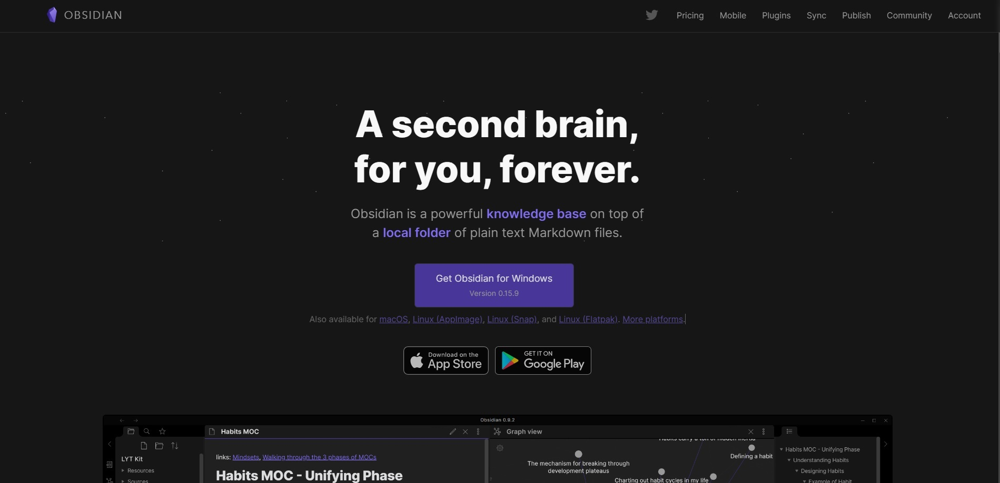

# Vaz Singh's 100DaysOfCloud Day [#7/100]

## What I've done today

Today marks one week since I started the [#100DaysOfCloud challenge](https://100daysofcloud.com/). 

As it's a weekend I've not been able to study as much as I would like but nonetheless I attempted to continue with the [AZ-104 Managing identities and governance in Azure](https://docs.microsoft.com/en-gb/learn/paths/az-104-manage-identities-governance/) module on Microsoft Learn. 

Today's focus has been mostly on learning how to create Azure users, users and groups and how manage them in Azure Active Directory. Unfortunately, the sandbox did not work for me today so I will revisit the exercises either tomorrow or early next week.

Another thing I did today was reflect on whether I'm taking adequate notes and how I'm organising my new-found knowledge. I think most of us say to ourselves "oh that's easy! I'll just Google it later if I need it.." and usually that's fine but occassionally we're unable to find the answer and we kick ourselves for not taking better notes. Going forward I'm going to start organising my study notes a bit better with [Obsidian](https://obsidian.md/).

 

## Learning Outcome

- [x] [Create Azure users and groups in Azure Active Directory](https://docs.microsoft.com/en-gb/learn/paths/az-104-manage-identities-governance/)

## Social Proof

[Twitter - Day #7](https://twitter.com/VazDoesTech/status/1561092684512727040)