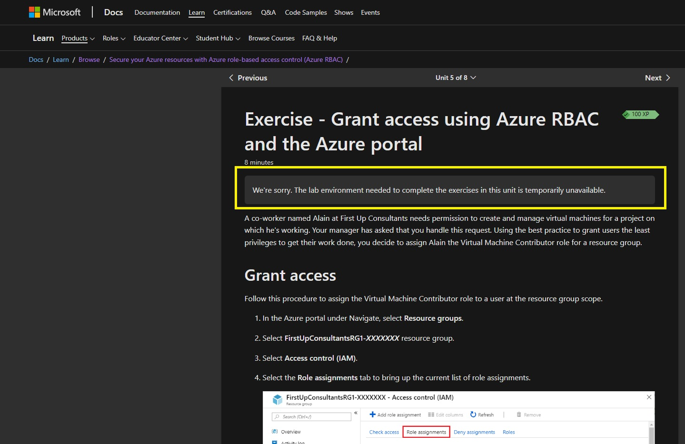

# Vaz Singh's 100DaysOfCloud Day [#8/100]

## What I've done today

Today I spent some time on the AZ-104 learning pathway looking at securing Azure resources with Azure role-based access control (Azure RBAC). I must admit, with the sun out it wasn't an intense study session today.

As highlighted earlier in this week, some of the current content (and certainly the stuff covered this week) has been a recap of the previous learning I did for the AZ-900 and SC-900 exams.

Frustratingly the sandbox labs provided on the Microsoft Learn website didn't work for me today either. Hopefully these will be back up and running soon.

 

>Fun fact:  Azure RBAC has more than 70 built-in roles

## Social Proof

[Twitter - Day #8](https://twitter.com/VazDoesTech/status/1561255532564041733)